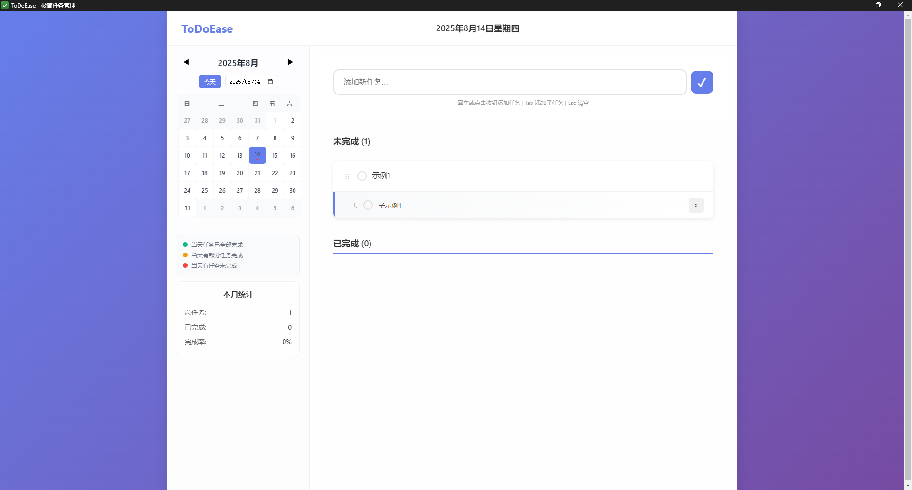

# ToDoEase - 极简任务管理

一款本地运行的极简个人任务管理桌面应用，专注帮助用户快速记录和管理今日任务。



## ✨ 特性

- **极致简洁** - 零学习成本，即开即用
- **高效交互** - 以键盘快捷键为核心操作方式  
- **完全本地化** - 无需网络，数据安全存储在本地
- **子任务支持** - 每个任务可添加多个子任务
- **拖拽排序** - 支持拖拽调整任务优先级
- **实时进度** - 顶部实时显示完成进度

## 🚀 快速开始

### 方式一：直接运行（推荐）

1. 确保安装了Python 3.7+
2. 双击运行 `run.py` 或在命令行中运行：
   ```bash
   python run.py
   ```
3. 打开浏览器访问 `http://127.0.0.1:8000`

### 方式二：桌面应用（需要Node.js）

1. 安装依赖：（electron需要手动安装）
   ```bash
   npm install
   pip install -r requirements.txt
   ```

2. 开发模式：
   ```bash
   npm run electron-dev
   ```

3. 构建桌面应用：
   ```bash
   npm run build
   ```

## ⌨️ 快捷键

| 快捷键 | 功能 |
|--------|------|
| `Enter` | 添加任务/子任务 |
| `Esc` | 清空输入 |
| `Tab` | 在任务输入后创建子任务 |
| `Space` | 切换任务完成状态 |
| `Delete` | 删除任务/子任务 |
| `Ctrl/Cmd + N` | 快速新建任务 |

## 🎯 核心功能

### 任务管理
- 快速添加、编辑、删除、完成任务
- 任务包含：标题、描述（可选）、完成状态、创建时间
- 支持拖拽排序调整优先级

### 子任务支持
- 每个任务可添加多个子任务
- 子任务可独立设置完成状态
- 任务完成进度会根据子任务完成情况自动更新
- 子任务可折叠/展开显示

### 任务视图
- 今日任务一屏展示
- 未完成和已完成分区显示
- 顶部实时显示完成进度
- 单击编辑，双击查看详情

## 🛠️ 技术栈

- **后端**: FastAPI + SQLAlchemy + SQLite
- **前端**: HTML/CSS/JavaScript + 现代CSS设计
- **桌面**: Electron（可选）
- **数据库**: SQLite（本地存储）

## 📁 项目结构

```
ToDoEase/
├── backend/           # Python后端
│   ├── __init__.py
│   ├── main.py       # FastAPI应用
│   ├── database.py   # 数据库模型
│   └── models.py     # Pydantic模型
├── frontend/         # 前端静态文件
│   ├── index.html
│   ├── styles.css
│   └── script.js
├── electron/         # Electron桌面应用
│   └── main.js
├── requirements.txt  # Python依赖
├── package.json     # Node.js依赖
└── run.py           # 启动脚本
```

## 🔧 API 接口

| 端点 | 方法 | 描述 |
|------|------|------|
| `/api/tasks` | GET | 获取所有任务 |
| `/api/tasks` | POST | 创建新任务 |
| `/api/tasks/{id}` | PUT | 更新任务 |
| `/api/tasks/{id}` | DELETE | 删除任务 |
| `/api/tasks/{id}/subtasks` | POST | 创建子任务 |
| `/api/subtasks/{id}` | PUT | 更新子任务 |
| `/api/subtasks/{id}` | DELETE | 删除子任务 |
| `/api/tasks/reorder` | PUT | 重新排序任务 |
| `/api/stats` | GET | 获取统计信息 |

## 🗄️ 数据存储

所有数据存储在本地SQLite数据库文件 `todoease.db` 中，包含：

- **tasks表**: 存储主任务信息
- **subtasks表**: 存储子任务信息
- 自动保存，无需手动操作

## 🔧 开发指南

### 环境要求
- Python 3.7+
- Node.js 14+ (可选，仅用于桌面应用)

### 安装依赖
```bash
# Python依赖
pip install -r requirements.txt

# Node.js依赖 (可选) electron需要手动安装 
npm install
```

### 开发模式
```bash
# 启动后端开发服务器
python run.py

# 启动Electron开发模式 (需要Node.js)
npm run electron-dev
```

### 构建发布
根目录运行 build-complete.bat 文件

## 🐛 常见问题

### 端口被占用
如果8000端口被占用，可以在 `run.py` 中修改端口号：
```python
uvicorn.run(app, host="127.0.0.1", port=8001)  # 改为其他端口
```

### 数据库重置
删除 `todoease.db` 文件即可重置所有数据。

## 📊 数据统计

应用会自动跟踪以下统计信息：
- 总任务数
- 已完成任务数
- 完成率
- 今日新增任务
- 今日完成任务

## 🎯 使用技巧

1. **快速添加任务**：输入任务后直接按Enter，无需点击按钮
2. **批量管理**：使用Ctrl+N快速创建多个任务
3. **优先级管理**：拖拽任务可调整优先级顺序
4. **子任务规划**：为复杂任务创建子任务，逐步完成
5. **每日回顾**：利用顶部进度条了解当日完成情况

## 🔐 数据安全

- 所有数据本地存储，不上传云端
- SQLite数据库文件可备份到其他位置
- 支持导出数据为JSON格式

## 🤝 贡献指南

欢迎提交Issue和Pull Request！

1. Fork本项目
2. 创建功能分支 (`git checkout -b feature/AmazingFeature`)
3. 提交更改 (`git commit -m 'Add some AmazingFeature'`)
4. 推送到分支 (`git push origin feature/AmazingFeature`)
5. 创建Pull Request

## 🙏 致谢

- 特别感谢使用ToDoEase的每一位用户

---

**Made with ❤️ for productivity enthusiasts**